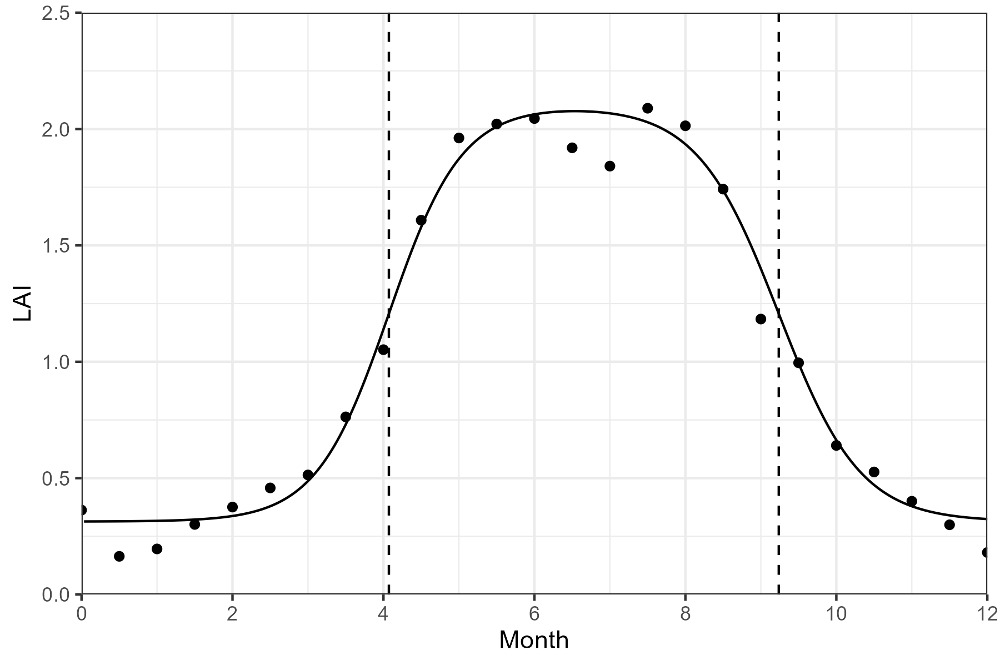
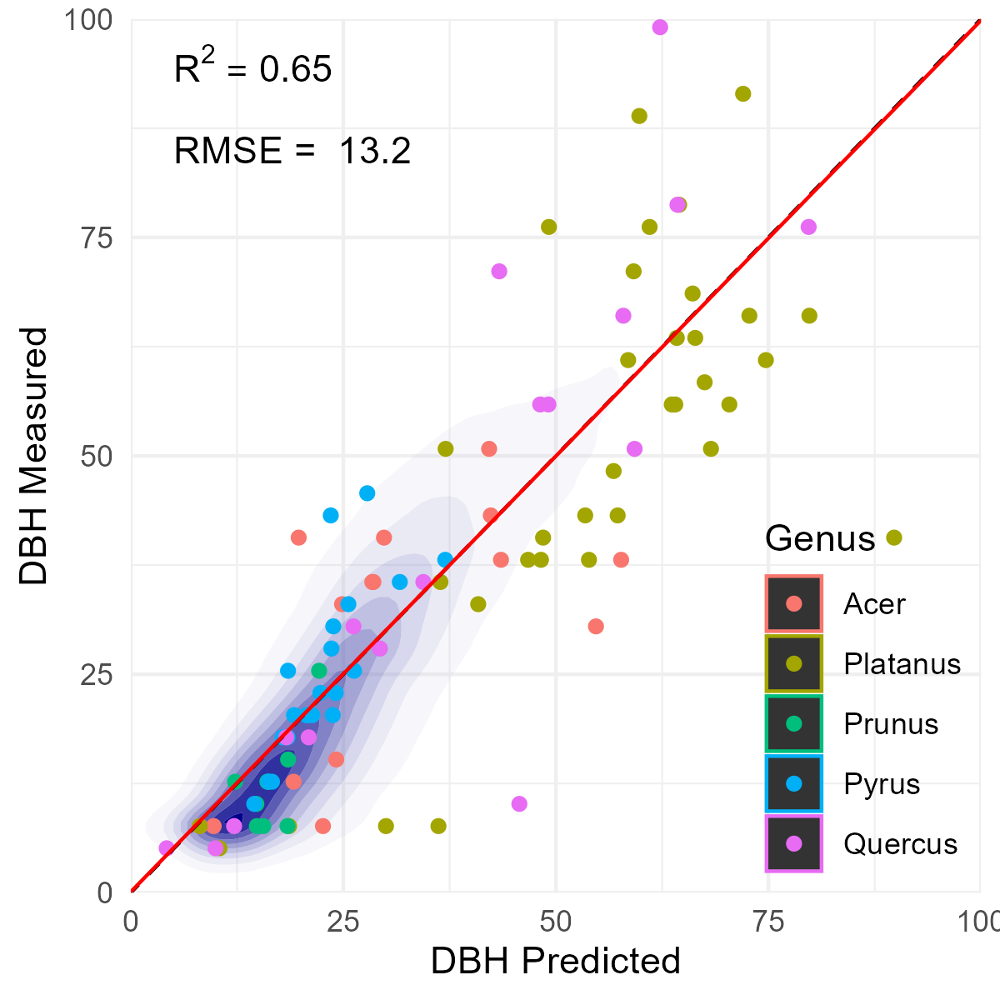
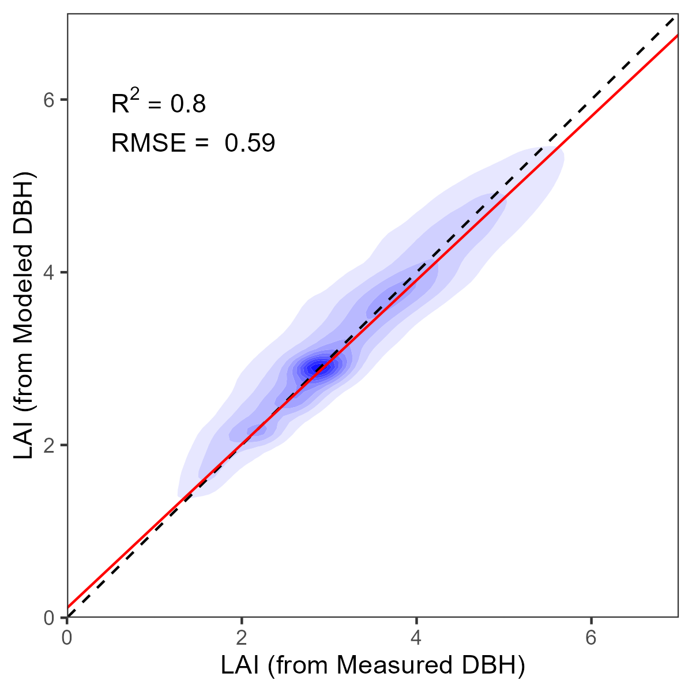
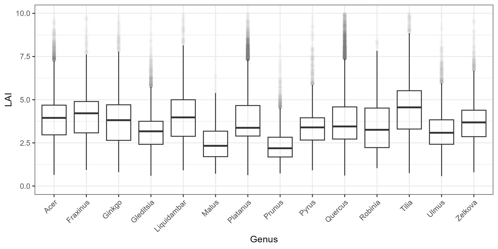
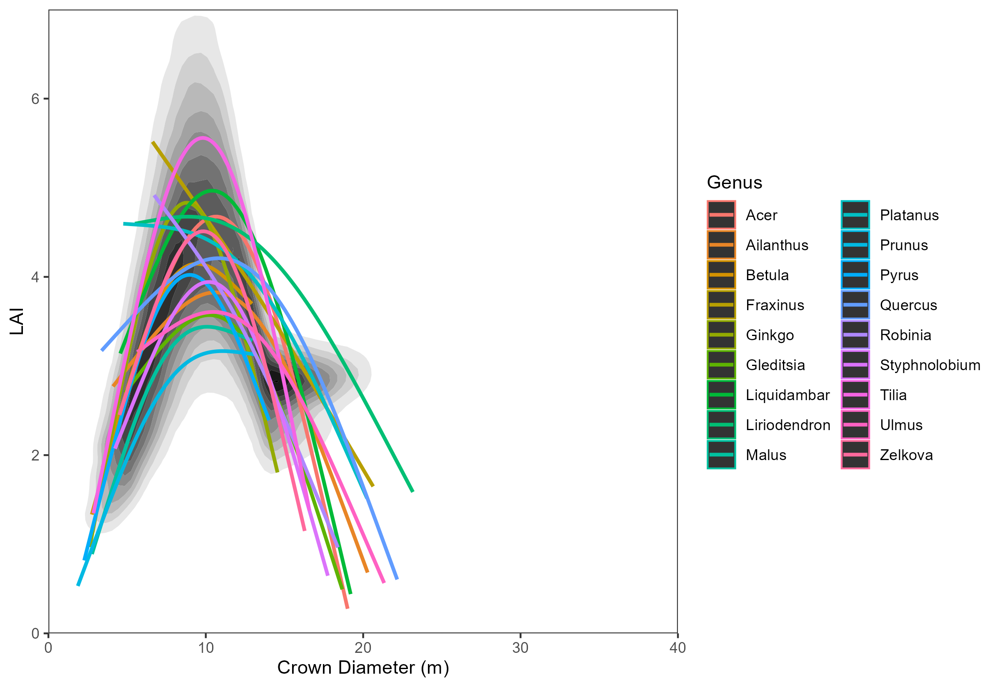
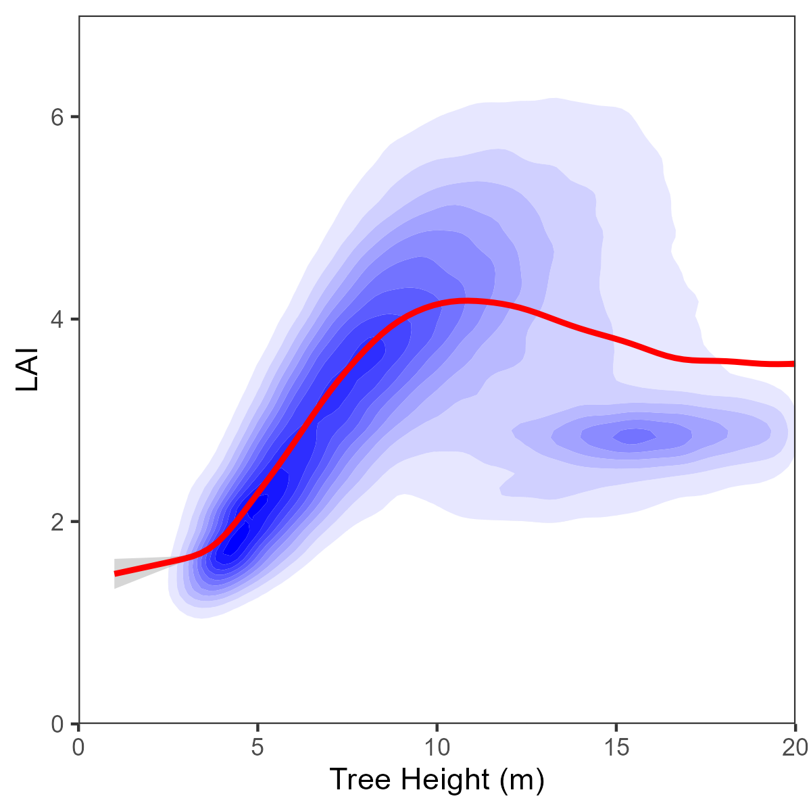
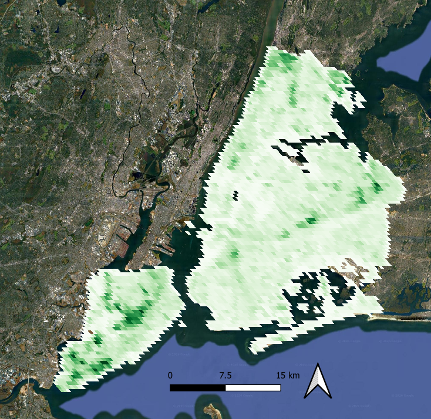

# Allometric Estimation of Tree LAI
Using crown morphometrics (crown height, diameter) from LiDAR, diameter at breast height (DBH) from field surveys, and genus labels from a combination of field surveys and a satellite phenology-based classifier to estimate crown-level leaf area index (LAI) values. Then, aggregating values to a grid scale, normalizing seasonally using MODIS phenology patterns, and converting to outputs for use in a urban climate model. 

# Data Incorporated

First, all trees are segmented from aerial imagery or LiDAR data. We are using an existing crown segments model produced by UVM: [Crown Segments Source](https://zenodo.org/records/14053441)

Next, we use classified tree genus labels. Labels are assigned by an XGBoost model trained with field-labelled trees, PlanetScope phenology, and LiDAR crown metrics: [Tree Genus Labels](https://zenodo.org/records/20848642)

We generate seasonal estimates of MODIS LAI at the whole-city scale by applying [Phenofit](https://cran.r-project.org/web/packages/phenofit/index.html) to estimate double-sigmoidal models in the [MODIS 4-day LAI product](https://developers.google.com/earth-engine/datasets/catalog/MODIS_061_MCD15A3H). Values are averaged across the whole city from the original 500 m resolution. 



# Crown Base Height Estimates

We use UFIA data from New York City to build models for crown base height at the genus level for important genera in NYC. Models are expressed as: 

```
crown_base_height ~ max_tree_height + crown_diameter + 0 + (1 | genus)
```

# Diameter at Breast Height Estimates

Likewise, we estimate DBH values for those trees which did not have DBH recorded in the field (~80% of individuals):

```
diameter_at_breast_height ~ max_tree_height + crown_diameter + 0 + (max_tree_height | genus)
```

This model performs reasonably well at estimating DBH values overall:

<p align="center">
  
</p> 

The actual effect on LAI estimates downstream is less, because DBH provides only one component of the allometric model (in Nowak 1995, it only affects the shading parameters): 

<p align="center">
  
</p> 

# LAI Estimates at the Individual Tree Level

We use the allometric equations specified by [Nowak, 1996 for iTree](https://www.fs.usda.gov/nrs/pubs/gtr/gtr_nrs200-2023.pdf). These rely on crown height (tree height - crown base height), crown diameter, diameter at breast height, and genus-level shading information. We observe substantial variation in LAI values across trees of different genera, and across different tree sizes within genera: 







# Scaling For Climate Models:

Finally, we rescale our data to grid cell scale for use in an urban climate model. Currently we do this at a set of weather stations for initial testing. We also include outputs at 500 m wall-to-wall scale, using the MODIS sinusoidal projection: 




